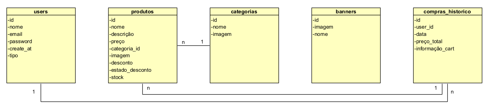

# Cesta24 - Supermercado Online

Cesta24 é uma plataforma inovadora de supermercado online, desenvolvida para proporcionar conveniência, praticidade e economia de tempo aos seus usuários. Com este serviço, os clientes podem realizar suas compras de supermercado diretamente pela internet, sem sair de casa.

## Funcionalidades

- **Classificação por Categorias**  
  Produtos organizados em diversas categorias, incluindo:
  - Alimentos frescos
  - Congelados
  - Mercearia
  - Produtos de limpeza
  - Higiene pessoal
  - Bebidas
  - E muito mais!

- **Busca Avançada**  
  Pesquisa por nome, promoções ou categoria de produto.

- **Filtros**  
  Permite filtrar produtos por:
  - Categorias
  - Promoções

## Fluxo de Navegação

### 1. Homepage
Apresenta a plataforma, destaca funcionalidades e convida o usuário a começar suas compras.

### 2. Login/Registro
Permite que os usuários acessem suas contas ou se cadastrem para iniciar as compras.

### 3. Lista de Produtos
Exibe os produtos disponíveis, organizados por tópicos, com opções de seleção personalizada.

### 4. Lista de Descontos
Exibe os produtos disponíveis, organizados por tópicos, com opções de seleção personalizada.

### 5. Cesta de Compras
Exibe os produtos disponíveis, organizados por tópicos, com opções de seleção personalizada.

### 6. Histórico de Compras
Exibe os produtos disponíveis, organizados por tópicos, com opções de seleção personalizada.

### 7. Adicionar Produtos (Administrador)
Permite ao administrador adicionar novos produtos ao catálogo.

### 8. Editar Produtos (Administrador)
Facilita a atualização das informações de produtos existentes no catálogo.

### 9. Eliminar Produtos (Administrador)
Permite ao administrador Eliminar produtos do catálogo.

### 10. Adicionar Categorias (Administrador)
Permite ao administrador adicionar novas Categorias.

### 11. Editar Categorias (Administrador)
Facilita a atualização das informações de Categorias existentes.

### 12. Eliminar Categorias (Administrador)
Permite ao administrador remover Categorias.

### 13. Adicionar Banners (Administrador)
Permite ao administrador adicionar novos Banners.

### 14. Editar Banners (Administrador)
Facilita a atualização das informações de Banners existentes no catálogo.

### 15. Eliminar Banners (Administrador)
Permite ao administrador remover Banners.

### 16. Adicionar Stock (Administrador)
Permite ao administrador gerir o stock dos produtos do catálogo.

## Perfis de Usuários

- **Usuário (Cliente)**  
  Permite que os clientes façam compras de forma fácil e personalizada.

- **Administrador**  
  Gerencia o sistema e garante o funcionamento eficiente da plataforma.

## Link Website
**cesta24.great-site.net**